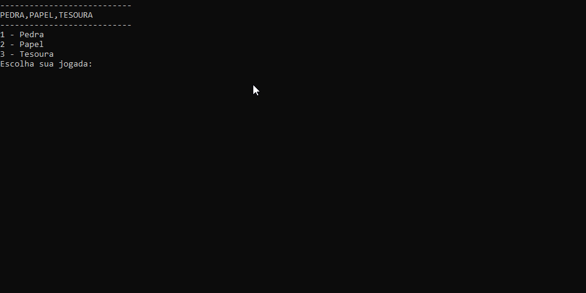

#  PEDRA,PAPEL,TESOURA



## Introdução

Um jogo de pedra,papel,tesoura entre o usuario e o computador

## Regras do jogo

1 - o jogador escolhe entre 3 opcoes (pedra,papel,tesoura) e computador faz o mesmo de maneira aleatoria e anonima ao jogador

2 - as opcoes são comparadas e depois são apresentados o que cada um escolheu e se o jogador ganhou,perdeu ou empatou com o computador

3 - é dada a opção de jogar novamente ao jogador

## Funções

**- Geração de numero aleatório:** o computador seleciona entre as 3 opcoes de jogada de maneira a aleatoria e anonima a cada novo jogo

**- Tratamento de erros:** o jogador só pode escolher entre:
1 - pedra
2 - papel
3 - tesoura

## Como ultilizar

1. Extraia o arquivo PedraPapelTesoura.ConsoleApp do repositório com .zip;

2. Restaure as dependecias do projeto com o ```comando```:
```
dotnet restore
```
3. Agora va até o diretório raiz e execute no terminal com o ```comando```:
```
dotnet run --project  PedraPapelTesoura.ConsoleApp
```

## Requisitos

.NET SDK (versão 10)